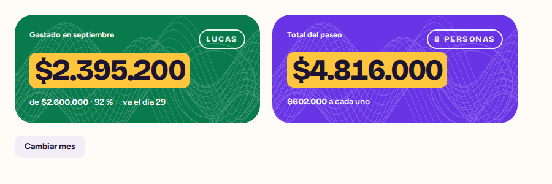
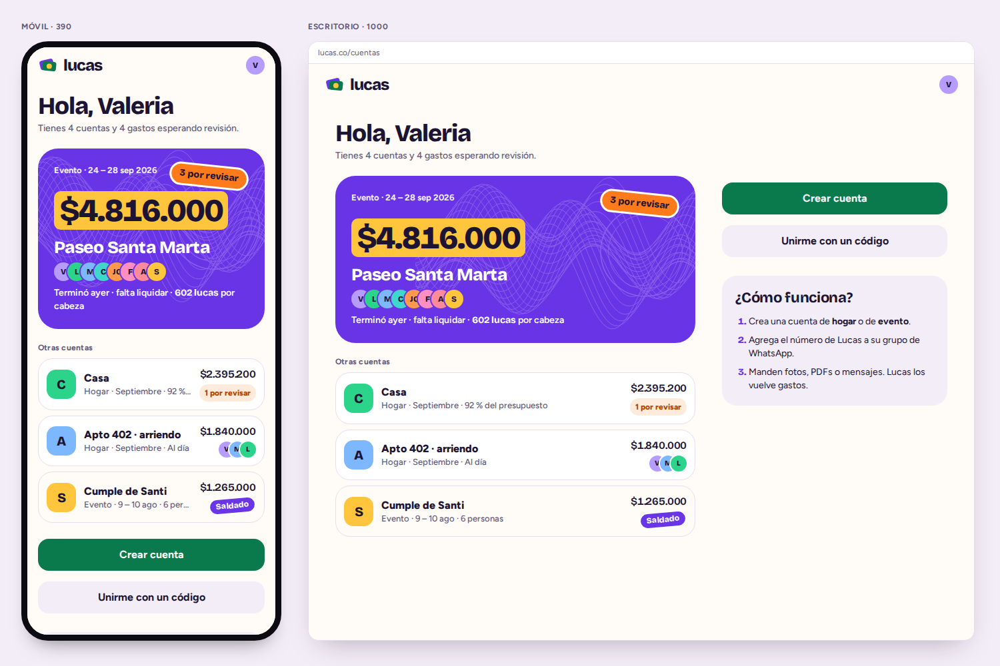
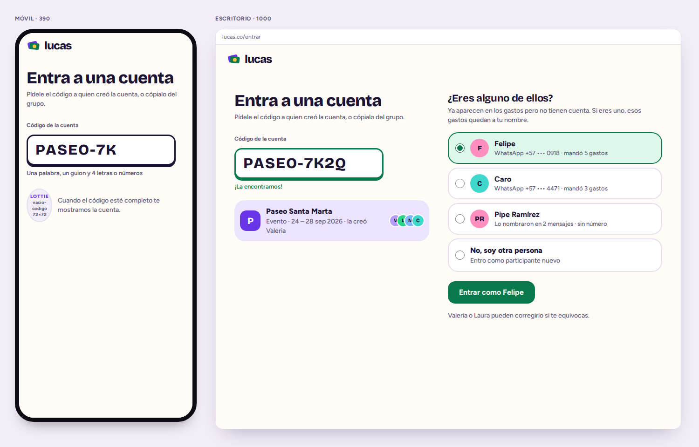
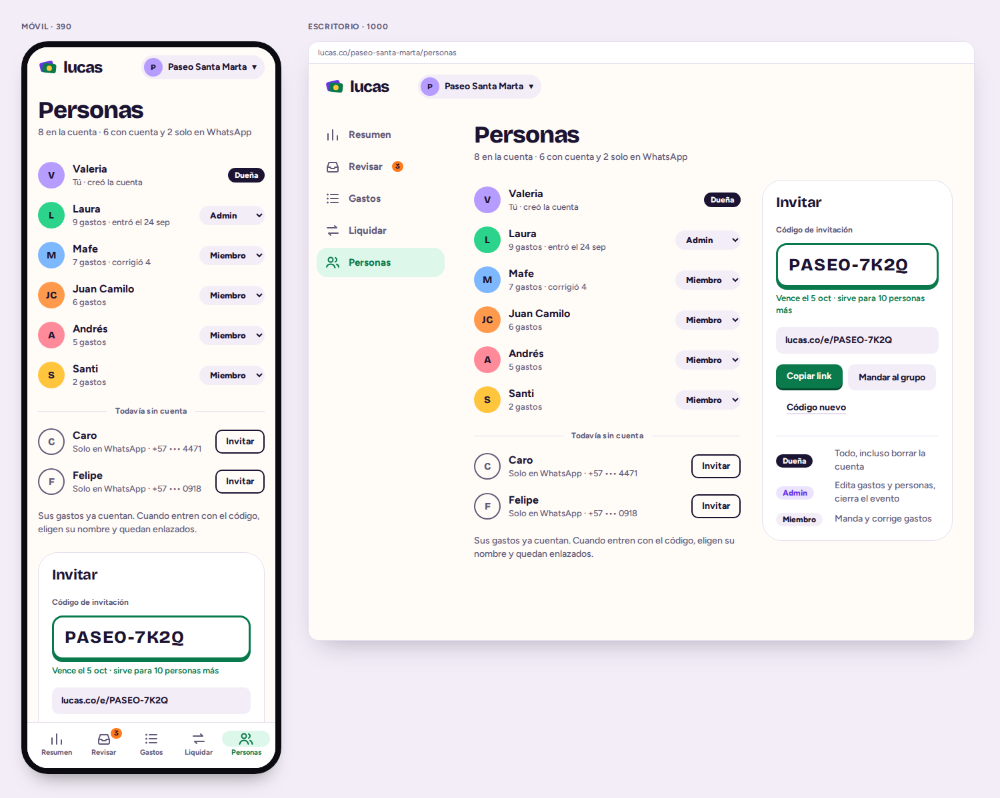
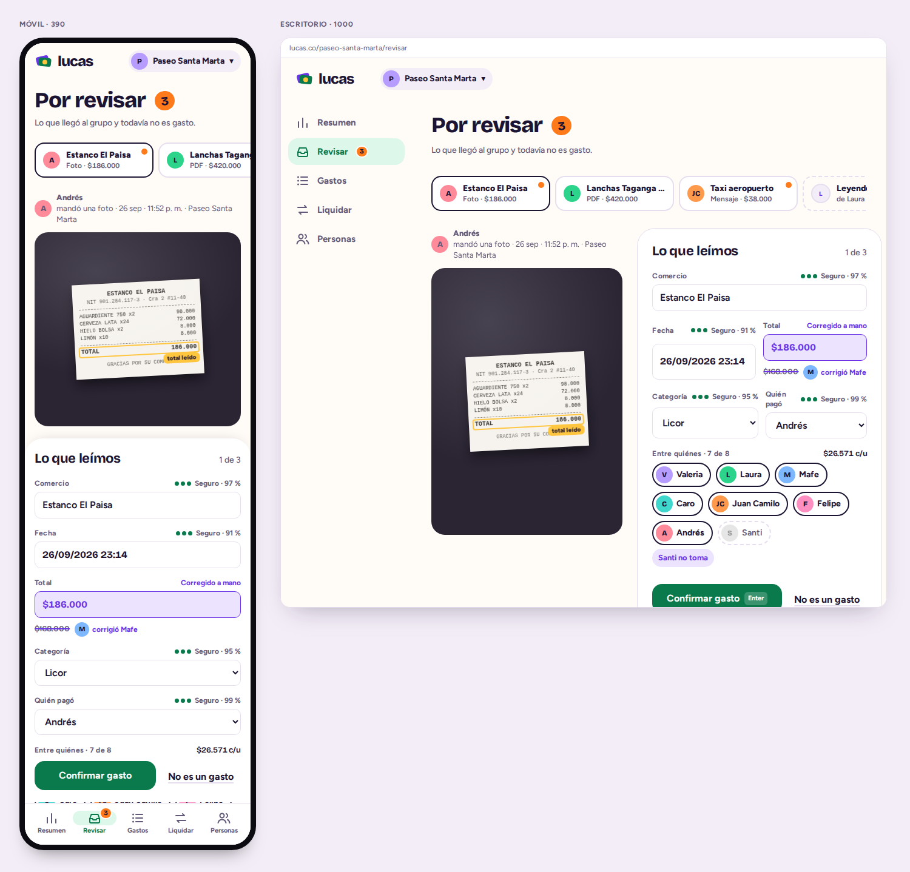
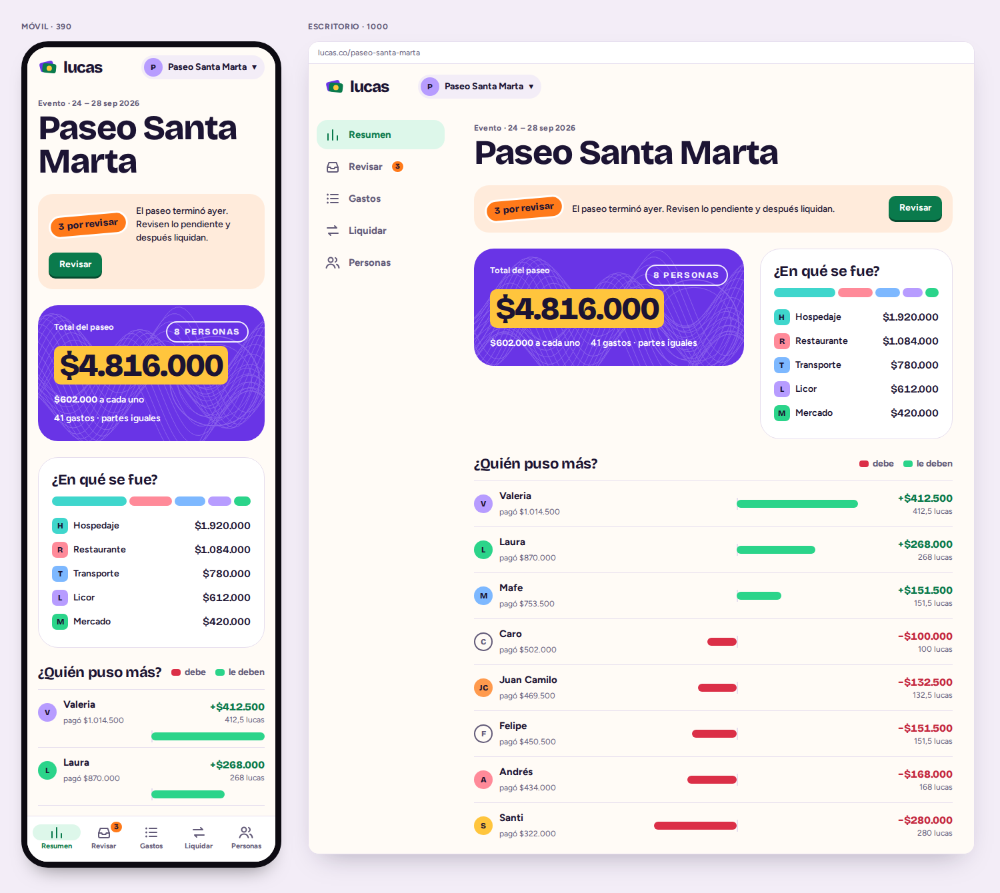
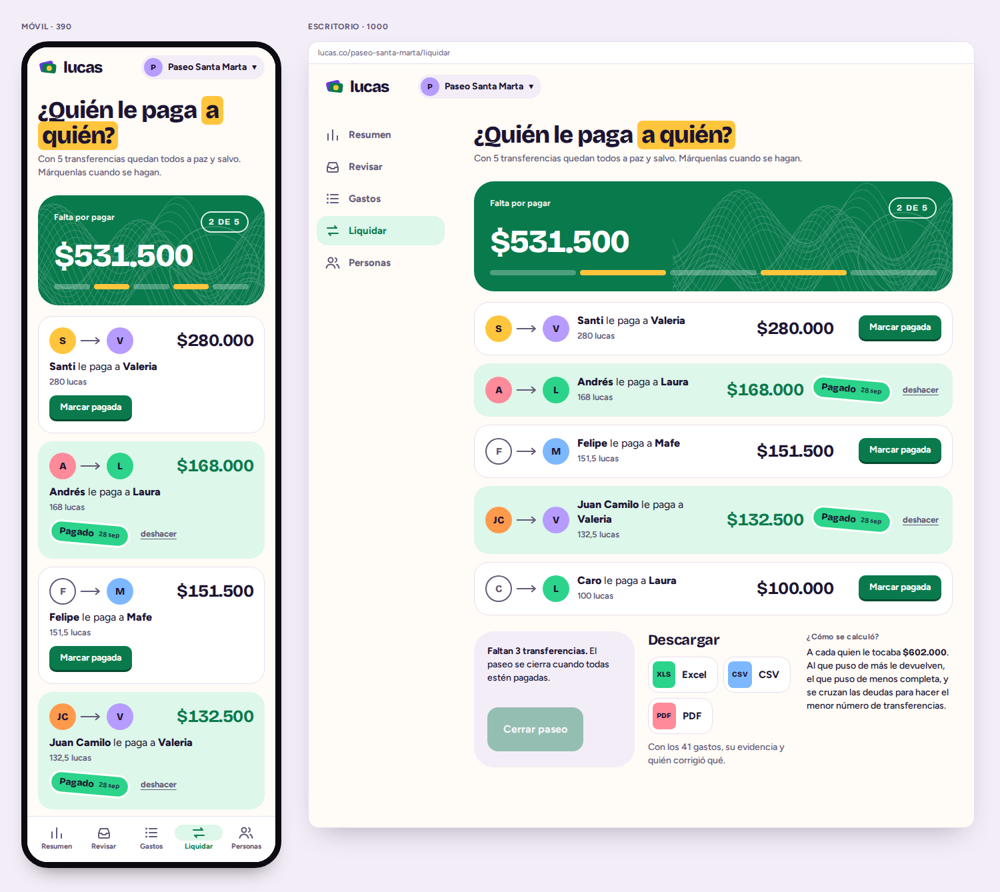
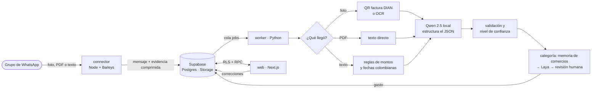

<div align="center">


# luks

**Las cuentas compartidas de tu grupo de WhatsApp, sin hacer cuentas.**

Manden la foto del recibo al grupo y Luks la vuelve un gasto clasificado,<br />
dividido y listo para liquidar. En pesos colombianos, sin decimales y sin Excel.

<br />


<br />

<picture>
  <source media="(prefers-color-scheme: dark)" srcset="lucas-design-kit/capturas/componente-tarjeta-billete-noche.png" />
  
</picture>

</div>

<br />

## ¿Qué es?

«Me debes 40 lucas». Así se habla de plata en Colombia, y de ahí sale el nombre.

1. **Mandan** fotos de recibos, PDFs o mensajes («pagué 100 lucas de taxis») al grupo de WhatsApp de siempre.
2. **Un número contador** de Luks está en el grupo, lo lee todo y lo vuelve gastos: comercio, fecha, total, ítems, categoría y quién pagó.
3. **En la web** revisan lo que la IA no leyó seguro, corrigen, ven presupuestos y, al final del paseo (o de cada mes en la casa), Luks dice **quién le paga a quién** con el mínimo de transferencias.

Hay dos tipos de cuenta:

| | Para qué | Ejemplo |
|---|---|---|
| **Hogar** | Continua, con presupuesto mensual por categoría; se liquida mes a mes | «Casa», de Valeria y Andrés |
| **Evento** | Con inicio y fin; termina en una liquidación | «Paseo Santa Marta», 8 amigos, 24 – 28 sep |

## Así se ve

<table>
  <tr>
    <td width="50%">
      <picture>
        <source media="(prefers-color-scheme: dark)" srcset="lucas-design-kit/capturas/1-selector-cuentas-noche.png" />
        
      </picture>
      <p align="center"><b>Selector de cuentas</b> · fase 2 ✓</p>
    </td>
    <td width="50%">
      <picture>
        <source media="(prefers-color-scheme: dark)" srcset="lucas-design-kit/capturas/6-entrar-con-codigo-noche.png" />
        
      </picture>
      <p align="center"><b>Entrar con código</b> · fase 2 ✓</p>
    </td>
  </tr>
  <tr>
    <td width="50%">
      <picture>
        <source media="(prefers-color-scheme: dark)" srcset="lucas-design-kit/capturas/8-personas-noche.png" />
        
      </picture>
      <p align="center"><b>Personas, roles e invitaciones</b> · fase 2 ✓</p>
    </td>
    <td width="50%">
      <picture>
        <source media="(prefers-color-scheme: dark)" srcset="lucas-design-kit/capturas/2-bandeja-revision-noche.png" />
        
      </picture>
      <p align="center"><b>Bandeja de revisión</b> · fase 3 ✓</p>
    </td>
  </tr>
  <tr>
    <td width="50%">
      <picture>
        <source media="(prefers-color-scheme: dark)" srcset="lucas-design-kit/capturas/4-resumen-evento-noche.png" />
        
      </picture>
      <p align="center"><b>Resumen del paseo</b> · fase 3 ✓</p>
    </td>
    <td width="50%">
      <picture>
        <source media="(prefers-color-scheme: dark)" srcset="lucas-design-kit/capturas/5-liquidacion-noche.png" />
        
      </picture>
      <p align="center"><b>Liquidación</b> · fase 6 ✓</p>
    </td>
  </tr>
</table>

<sub>Capturas del sistema de diseño (<a href="lucas-design-kit/LUCAS_DISENO.md">lucas-design-kit</a>), la referencia visual de cada pantalla. Cambian solas entre Día y Noche según el tema de GitHub.</sub>

## Cómo funciona por dentro



- **Deduplicación** por id del mensaje de WhatsApp, huella perceptual de la imagen y CUFE de la factura electrónica.
- **Cada corrección humana** actualiza la memoria de comercios de la cuenta y queda como ejemplo para reentrenar Laya (en Colab o Kaggle, nunca en el servidor).
- **Nada de APIs de IA pagas**: Ollama y Laya corren en CPU, en un servidor ARM gratuito.

## Estado del proyecto

- [x] **Fase 1 · Base de datos.** Monorepo, esquema completo con RLS y RPC, semilla y pruebas de permisos; borrar un usuario pasa sus cuentas a un admin.
- [x] **Fase 2 · Web.** Entrada con correo y contraseña (con recuperación), enlace mágico o Google, selector de cuentas, crear cuenta de hogar o evento, unirse con código o link («¿Eres alguna de estas personas?»), personas, roles e invitaciones. Modo Día y Noche.
- [x] **Fase 3 · Subir, revisar y ver.** Subida de fotos (con la cámara del celular), PDFs o texto con compresión en el navegador; bandeja de revisión con evidencia y zoom, confianza por campo, correcciones y tiempo real; memoria de comercios y ejemplos de entrenamiento; resúmenes de hogar (categorías, 6 meses, presupuestos) y de evento (quién puso más); lista de gastos; PWA instalable; animaciones Lottie.
- [x] **Fase 4 · Worker.** [`services/worker`](services/worker/README.md) en Python reemplaza al procesador simulado: cola con reintentos y registro de errores, QR DIAN, pdfplumber, OpenCV + RapidOCR, Qwen 2.5 con JSON validado por Pydantic, confianza por campo, pagador según el mensaje, memoria de comercios con RapidFuzz, Laya sobre ONNX Runtime (multilingüe o inglés), duplicados por huella y CUFE, export y notebook para ajustar Laya, Docker para Oracle ARM y Sentry.
- [x] **Fase 5 · WhatsApp.** [`services/connector`](services/connector/README.md) en Node con Baileys detrás de una interfaz que luego puede implementar la API oficial: número contador y vinculaciones personales, reconexión y aviso si una sesión se cierra, credenciales cifradas (AES-256-GCM) en Postgres, enlace grupo-cuenta con «luks CÓDIGO», ingesta solo de grupos enlazados (fotos comprimidas, PDFs y mensajes con montos, sin repetir), «¿Quién es este número?» para los admins, confirmaciones en el grupo con límite de frecuencia y la pantalla «Conecta el grupo de WhatsApp» con estado en vivo. Categorías propias por cuenta («Salud»…) que Laya elige desde el primer gasto. Todo el servidor con [`deploy/docker-compose.yml`](deploy/README.md): connector, worker, Ollama y Uptime Kuma.
- [ ] **Fase 6 · Números.** ✓ [Liquidación](#cómo-se-liquida): cuánto puso cada uno, quién le paga a quién con el mínimo de transferencias, marcarlas pagadas, congelar y cerrar el paseo; el hogar mes a mes; descarga en CSV. Falta: editar presupuestos y exportar a Excel y PDF.
- [ ] **Fase 7 · Producción.** ✓ Perfil: cambiar el nombre (y cómo te llaman en cada cuenta), tus números de WhatsApp, ver correo, con qué entras y la política aceptada, descargar tus datos y eliminar tu cuenta (Ley 1581: acceso, rectificación, portabilidad y supresión). Falta: retención de evidencias.

## Cómo llegan los gastos

Por el **grupo de WhatsApp** (el connector deja en la cola las fotos, PDFs y mensajes con montos de los grupos enlazados) o por la **web**:

1. **Subir** (`/c/[cuenta]/subir` o el atajo «Subir un recibo» de la PWA): la foto se comprime en el navegador (1600 px, WebP o JPEG) y va al bucket privado `evidencias`, en la carpeta de la cuenta. También sirven PDFs o un mensaje como «taxis al aeropuerto 100 lucas, la pagó Santi».
2. `submit_upload` verifica que el archivo exista y que la persona sea de la cuenta, y crea el **mensaje** y el **trabajo** en la cola (`jobs`).
3. El **worker** ([`services/worker`](services/worker/README.md), en el servidor ARM) toma el trabajo, lee la foto, el PDF o el texto (QR DIAN, OCR, reglas y Qwen), valida, decide quién pagó, clasifica (memoria de comercios → Laya) y deja el gasto con confianza por campo. Si la cuenta ya conoce el comercio y todo se leyó seguro, lo confirma solo; si no, va a **Revisar**. Si es la misma foto o la misma factura (CUFE), el mensaje queda como «Ya estaba registrado».
4. En **Revisar**, un admin corrige y confirma con Enter. En **Gastos** se buscan por comercio (sin importar tildes) y se filtran por categoría, quién pagó, mes o «por revisar». Cada corrección alimenta la memoria de comercios y, si cambió la categoría, queda como ejemplo para reentrenar a Laya. Todo se actualiza en vivo con Supabase Realtime.

El **procesador simulado** de la fase 3 atiende la cola hasta que el worker arranca y lo apaga (`worker_take_over()`). Sus funciones siguen en la base para probar en local sin el worker: `select public.run_simulated_worker();` procesa la cola a mano.

## Cómo se liquida

En **Liquidar** (`/c/[cuenta]/liquidar`) cualquiera de la cuenta ve dos cosas:

| | |
|---|---|
| **¿Cuánto puso cada uno?** | Lo que pagó, lo que le tocaba (su parte de cada gasto en que participó) y la diferencia: **+** le deben, **−** debe. Al tocar a alguien se ven los gastos que pagó. |
| **¿Quién le paga a quién?** | El mínimo de transferencias para que todos queden igual: «Andrés le paga a Valeria $282.400», y debajo «282,4 lucas». |

Un ejemplo con el paseo de la semilla: gastaron $4.816.000 entre 8, así que a cada uno le tocaba $602.000. Mafe pagó $1.400.000, así que le devuelven $798.000. Caro no pagó nada, así que pone $602.000. Luego se cruzan las deudas para que haya las menos transferencias posibles.

1. **Vista previa.** Mientras no se liquida, la pantalla muestra cómo quedarían las transferencias y se actualiza con cada gasto nuevo.
2. **Liquidar.** Lo hace un admin cuando no queda nada por revisar. `start_settlement` vuelve a calcular los saldos en la base, verifica que las transferencias dejen a todos en cero y las guarda. Desde ahí lo liquidado queda **congelado**: el monto, quién pagó, la fecha y la división de esos gastos no cambian. Un trigger lo impide, también para el worker. El comercio y la categoría sí se siguen corrigiendo.
3. **Marcar pagadas.** Quien paga, quien recibe o un admin marca cada transferencia, y los demás lo ven al instante.
4. **Cerrar** (paseo). Con todo pagado, «Cerrar paseo» lo archiva en solo lectura y vence las invitaciones. Un paseo con gastos ya no se puede cerrar sin liquidarlo.

| | Evento | Hogar |
|---|---|---|
| Qué se liquida | Todo el paseo | Un mes a la vez (‹ Septiembre 2026 ›) |
| Mientras se liquida | No entran gastos nuevos, ni por WhatsApp ni por la web | Los demás meses siguen abiertos |
| Al final | Se cierra y queda archivado | El mes queda saldado |

**¿Se equivocaron?** Mientras nadie haya pagado, un admin puede **reabrir**: se borran las transferencias y todo se vuelve a poder corregir.

**Qué cuenta.** Los gastos por revisar cuentan en la vista previa, pero hay que revisarlos antes de liquidar. Los que no tienen quién pagó o tienen la división incompleta no cuentan hasta corregirlos, y la pantalla avisa cuántos son.

**El algoritmo** ([`apps/web/lib/settlement.ts`](apps/web/lib/settlement.ts)). El mínimo de transferencias es *n − g*: *n* son las personas con saldo y *g* el mayor número de grupos que se saldan entre ellos. Se busca exacto con programación dinámica sobre subconjuntos, que es instantáneo hasta 20 personas con saldo; con más se usa el método voraz, que da como mucho *n − 1*. Todo va en pesos enteros: los pesos que sobran al dividir se reparten uno a uno, así que nada se pierde por redondeo.

**Descargar.** Un CSV para Excel (separado por «;» y con tildes) con los saldos, las transferencias y cada gasto con la parte de cada uno.

Todo está en [`00000000000120_liquidacion.sql`](supabase/migrations/00000000000120_liquidacion.sql): tablas `settlements` y `settlement_transfers`, `settlement_overview`, `start_settlement`, `mark_transfer`, `reopen_settlement` y `close_account`. Las pruebas del flujo completo están en `supabase/tests/liquidacion.test.ts`.

### Compartir y cobrar a quien no usa la app

- **Link público** (`/r/TOKEN`). Desde Liquidar, un admin crea un link donde cualquiera ve, sin entrar, cuánto puso cada uno, cuánto le toca, en qué se fue la plata y quién le paga a quién. Con `?p=persona` se abre primero lo de esa persona («Santi, te toca $602.000 · Págale $280.000 a Valeria»), y eso mismo sale en la vista previa de WhatsApp. No muestra fotos de recibos, números ni correos; los buscadores no lo guardan; se puede cambiar o quitar. Al final lleva la publicidad de Luks: «Esto se hizo en mrluks.com», que también va en los mensajes y en la imagen del link.
- **Mandar las cuentas al grupo.** Al final de Liquidar, un solo mensaje para todo el grupo con cuánto fue, quién le paga a quién (las pagadas, tachadas) y el link; se ve antes cómo les llega. El link sale en WhatsApp con una imagen de Luks con el total y las transferencias (`/r/TOKEN/imagen`, hecha con `next/og` en [`apps/web/lib/imagen-cuentas.tsx`](apps/web/lib/imagen-cuentas.tsx); con `?p=persona`, lo de esa persona). Las fuentes de la imagen son TTF estáticos en `apps/web/assets/og` (la imagen no lee woff2 ni fuentes variables).
- **Cobrar por WhatsApp.** Cada transferencia pendiente tiene «Cobrarle por WhatsApp» (a quien le deben) o «Recordarle» (el admin): abre WhatsApp con el mensaje listo y el link personal. Si se conoce el número de la persona, va directo a su chat; si no, se elige el contacto.
- **Invitar por WhatsApp** (Resumen y Personas): manda el link de invitación; si la cuenta no tiene un código vigente, se crea uno.
- **Recibos en retrospectiva.** «Pagué yo y después agrego a la gente»: en Personas se agregan varias de una vez («Mafe, Santi y Caro») y, si se quiere, se suman a los gastos que estaban divididos entre todos.

### Dividir por consumo (quién pidió qué)

Para la noche en que uno paga la cuenta de todos y no pidieron lo mismo: en el gasto (o en Revisar), «Dividir por consumo» abre la factura al lado de tres pasos:

1. **¿Quiénes estaban?** Se marcan, y quien falte se agrega ahí mismo aunque no use Luks («Pipe y la prima de Juan»: quedan como personas de la cuenta, sin usuario). También se elige quién pagó.
2. **¿Quién pidió qué?** Los ítems que leyó Luks de la foto (o los que se escriben a mano, con su precio). Cada ítem se divide entre quienes lo pidieron; sin nadie marcado, entre todos. Lo que no está en los ítems (propina, servicio) se reparte según lo que consumió cada uno.
3. **¿Cuánto pone cada uno?** Si alguien quiere poner más (o menos), se cambia su monto: el resto se reparte entre los demás en la misma proporción.

Los montos se calculan en [`apps/web/lib/consumo.ts`](apps/web/lib/consumo.ts) (pesos enteros que suman exacto el total) y se guardan con `split_by_items` ([`00000000000170_dividir_por_consumo.sql`](supabase/migrations/00000000000170_dividir_por_consumo.sql)): la parte de cada uno queda en `expense_splits` como cualquier división (con `fixed` para quien puso su monto) y quién pidió qué en `expense_item_people`, así se puede volver a abrir. Al revisar o corregir el gasto la división por consumo se respeta (si cambian el total, hay que volver a dividir). Pruebas en `supabase/tests/consumo.test.ts` y `apps/web/lib/consumo.test.ts`.

### La gente del grupo es la gente de la cuenta

Al conectar el grupo con «luks CÓDIGO», cada integrante queda como persona de la cuenta, y quien entra después al grupo aparece solo ([`00000000000160_integrantes_del_grupo.sql`](supabase/migrations/00000000000160_integrantes_del_grupo.sql)). Si su número ya es de alguien, no se repite; si es el WhatsApp vinculado de alguien de la cuenta, es esa persona; si alguien agregado a mano tiene el mismo nombre y no tiene WhatsApp, se le pone el número; si no, se crea con el nombre que se puso en WhatsApp (o «WhatsApp 4567»). El número de Luks no cuenta, y quien sale del grupo no se borra porque sus gastos siguen contando.

**WhatsApp siempre a la vista.** Es el motor de Luks, así que tiene un botón arriba en todas las pantallas de la cuenta (verde si Luks está leyendo el grupo, rojo si se cayó, «Conectar WhatsApp» si todavía no hay grupo), un lugar en el menú lateral, una tarjeta grande en el Resumen mientras la cuenta no tenga grupo, y una cuenta nueva lleva directo a conectarlo.

Está en [`00000000000150_compartir.sql`](supabase/migrations/00000000000150_compartir.sql) (`account_shares`, `shared_overview`, `create_share_link`, `add_people`) y [`apps/web/lib/share.ts`](apps/web/lib/share.ts); pruebas en `supabase/tests/compartir.test.ts`.

## Stack

| Capa | Tecnología |
|---|---|
| Web | Next.js 16 (App Router) · React 19 · TypeScript · TanStack Query · React Hook Form + Zod · Radix UI (sin estilos) |
| Diseño | Sistema propio: `tokens.css` + `lucas.css`, Bricolage Grotesque y Figtree, sin Tailwind |
| Datos | Supabase: Postgres, Auth, Storage privado, Realtime, RLS, RPC, pg_cron |
| WhatsApp | Baileys detrás de una interfaz, listo para migrar a WhatsApp Cloud API |
| Worker | Python 3.12 · uv · Pydantic · httpx · zxing-cpp · pdfplumber · OpenCV · RapidOCR · imagehash · RapidFuzz · Sentry |
| IA local | Ollama (Qwen 2.5, JSON con esquema) y Laya sobre ONNX Runtime (multilingüe o inglés), ajustado en Colab o Kaggle |
| Calidad | Biome · Vitest · PGlite (Postgres en WASM para probar RLS sin Docker) · Ruff · pytest · Playwright |
| PWA | Serwist (service worker con Turbopack), manifest con atajo a la cámara, página sin conexión |
| Infra | Vercel Hobby (web) · Supabase Free · Oracle Cloud Always Free ARM (connector, worker, Ollama) |

## Estructura

```
lucas/
├── apps/web/              Next.js: lo que ven los usuarios
│   ├── app/               rutas (login, selector, unirse, /c/[cuenta]/…)
│   ├── components/        componentes del kit de diseño
│   ├── lib/               fechas, invitaciones, compresión, liquidación, tiempo real, tipos (+ pruebas)
│   ├── public/lottie/     animaciones de LottieFiles recoloreadas a la paleta del kit
│   └── styles/            tokens.css y lucas.css del kit + app.css
├── supabase/
│   ├── migrations/        esquema, RLS y RPC
│   ├── templates/         correos de entrada con la marca
│   ├── tests/             196 pruebas de permisos, subidas, worker, WhatsApp, integrantes del grupo, categorías, liquidación, compartir, dividir por consumo, personas, perfil y semilla (PGlite)
│   └── seed.sql           «Casa» y «Paseo Santa Marta», iguales a las capturas
├── services/
│   ├── connector/         Node + Baileys: WhatsApp → cola (fase 5)
│   └── worker/            Python: OCR, QR DIAN, Ollama, Laya (fase 4)
├── deploy/                docker-compose del servidor y paso a paso en Oracle Cloud
└── lucas-design-kit/      sistema de diseño: manual, CSS, componentes y capturas
```

## Empezar

Necesitas Node 24 y pnpm 12 (`corepack enable`). Para la base de datos local, además, Docker y la [CLI de Supabase](https://supabase.com/docs/guides/local-development).

```bash
pnpm install
cp apps/web/.env.example apps/web/.env.local   # URL y publishable key de Supabase
pnpm dev                                       # http://localhost:3000
```

### Pruebas

```bash
pnpm db:test      # 196 pruebas de RLS, RPC, Storage, cola del worker, liquidación, compartir, dividir por consumo y semilla sobre Postgres real (PGlite), sin Docker
pnpm test         # todo el monorepo (incluye las 39 de apps/web/lib, entre ellas el mínimo de transferencias)
pnpm worker:test  # 149 pruebas del worker (necesita uv): recibos de ejemplo con OCR, QR y PDF reales
pnpm --filter @lucas/connector test   # 62 pruebas del connector: cifrado, textos, ingesta, límites y sesiones
pnpm typecheck    # tipos de rutas de Next + tsc
pnpm lint         # Biome
```

### Base de datos local

```bash
pnpm db:start     # Supabase local en Docker (Studio en http://localhost:54323)
pnpm db:reset     # migraciones + semilla
```

Con la semilla puedes entrar como `valeria@example.com` (titular de las dos cuentas), `laura@example.com` (admin del paseo) o `santi@example.com` (miembro), con la contraseña `lucas1234` o con enlace mágico: en local los correos llegan a Mailpit, en `http://localhost:54324`. Para probar el flujo de unirse, crea otro usuario y usa el código **PASEO-7K2Q**: Caro y Felipe esperan que alguien los reclame.

> La semilla crea usuarios de prueba: es solo para local. No la corras en el proyecto remoto.

## Configurar Supabase (una vez)

### 1. Esquema

```bash
npx supabase link --project-ref <tu-project-ref>
npx supabase db push          # aplica supabase/migrations
```

### 2. URLs de Auth

En **Authentication → URL Configuration** ([atajo al proyecto Luks](https://supabase.com/dashboard/project/zlmpsbwvtlyvwkkuknpj/auth/url-configuration)):

| Campo | Valor |
|---|---|
| **Site URL** | `https://mrluks.com`. **Nunca** `localhost` en el proyecto remoto. |
| **Redirect URLs** | `https://mrluks.com/**` · `https://www.mrluks.com/**` · `https://lucas-tau-black.vercel.app/**` · `http://localhost:3000/**` · y, si usas previews de Vercel, `https://lucas-*-tu-equipo.vercel.app/**` |

> **¿Google o el enlace del correo te llevan a `localhost` en el celular?** Es esto. La web le pide a Supabase volver a `https://<donde-estés>/auth/callback`; si esa URL no está en *Redirect URLs*, Supabase la ignora y usa la *Site URL*. Si la Site URL quedó en `http://localhost:3000`, en tu PC parece que funciona (ahí corre la app) y en cualquier otro lado falla. Los correos de entrar, confirmar y recuperar contraseña también usan la Site URL (`{{ .SiteURL }}` en las plantillas), así que se arreglan con el mismo cambio. En Google Cloud no hay que tocar nada: su URI de redirección es la de Supabase (`https://<project-ref>.supabase.co/auth/v1/callback`).

### 3. Correos con la marca

En **Authentication → Email Templates**, pega el HTML de [`supabase/templates/magic-link.html`](supabase/templates/magic-link.html) en *Magic Link* (asunto «Tu enlace para entrar a Luks») el de [`confirmation.html`](supabase/templates/confirmation.html) en *Confirm signup* (asunto «Entra a Luks») y el de [`recovery.html`](supabase/templates/recovery.html) en *Reset Password* (asunto «Pon una contraseña nueva en Luks»). Estas plantillas mandan un `token_hash`, así que el enlace sirve aunque lo abran en otro dispositivo, por ejemplo en el celular.

### 4. SMTP con Resend

El correo por defecto de Supabase es solo para pruebas y manda muy pocos por hora.

1. En [Resend](https://resend.com), verifica tu dominio (registros SPF y DKIM en tu DNS) y crea una **API key** con permiso *Sending access*.
2. En Supabase, **Project Settings → Authentication → SMTP Settings**, activa *Custom SMTP*:

   | Campo | Valor |
   |---|---|
   | Host | `smtp.resend.com` |
   | Puerto | `465` (SSL) o `587` (STARTTLS) |
   | Usuario | `resend` |
   | Contraseña | la API key de Resend (**secreta**: vive solo en Supabase) |
   | Remitente | `Luks <hola@tu-dominio.co>` |

3. En **Authentication → Rate Limits**, sube *Emails sent per hour* (con SMTP propio el tope lo pones tú; 30 alcanza para empezar).

### 5. Google

1. En [Google Cloud Console](https://console.cloud.google.com/): **APIs y servicios → Pantalla de consentimiento de OAuth** (externa, nombre «Luks», alcances `openid`, `email` y `profile`).
2. **Credenciales → Crear credenciales → ID de cliente de OAuth → Aplicación web**:
   - Orígenes de JavaScript autorizados: `https://tu-dominio.co` y `http://localhost:3000`.
   - URI de redireccionamiento autorizado: `https://<tu-project-ref>.supabase.co/auth/v1/callback`.
3. En Supabase, **Authentication → Sign In / Providers → Google**: pega el Client ID y el Client Secret (**secreto**) y actívalo.

### 6. Llaves

- La **publishable key** (`sb_publishable_…`) va en `apps/web/.env.local` y en Vercel. Es pública: la seguridad la da RLS.
- La **secret / service role key** jamás toca la web. Solo la usan `services/connector` y `services/worker` (cada uno tiene su `.env.example` documentado).

## Permisos

Todas las tablas tienen RLS forzado. Lo delicado (unirse, cambiar roles, sacar gente, cerrar la cuenta) solo pasa por funciones RPC que validan todo adentro, y hay privilegios por columna para que nadie cambie `owner_id`, `status` ni `claimed_by` por fuera de ellas.

| | Titular | Admin | Miembro |
|---|:---:|:---:|:---:|
| Ver gastos, personas y presupuestos | ✓ | ✓ | ✓ |
| Reportar gastos (quedan por revisar) | ✓ | ✓ | ✓ |
| Confirmar, corregir o borrar gastos | ✓ | ✓ | |
| Agregar personas que solo están en WhatsApp | ✓ | ✓ | |
| Crear y anular códigos de invitación | ✓ | ✓ | |
| Nombrar admins y sacar miembros | ✓ | ✓ | |
| Quitarle el rol a un admin o sacarlo | ✓ | | |
| Cerrar la cuenta | ✓ | ✓ | |
| Borrar la cuenta | ✓ | | |
| Salirse de la cuenta | | ✓ | ✓ |

Nadie cambia su propio rol, nadie se vuelve titular y al titular no lo toca nadie. Cada regla tiene su prueba en [`supabase/tests/permissions.test.ts`](supabase/tests/permissions.test.ts).

**Datos personales (Ley 1581 de 2012):** el esquema ya guarda el consentimiento (`profiles.privacy_accepted_at`, `people.consent_at`) y los días de retención de evidencias por cuenta (`accounts.evidence_retention_days`). El flujo de aceptación y el borrado por persona llegan en la fase 7.

## Diseño

La fuente de verdad visual es [`lucas-design-kit/`](lucas-design-kit/LUCAS_DISENO.md): identidad colombiana y vibrante, con colores de billete. Verde (el de 100 mil) para la marca y lo confirmado, morado (el de 50 mil) para eventos y correcciones hechas por personas, naranja para lo pendiente y coral para las alertas. Tarjeta billete con guilloche para la cifra protagonista, stickers rotados para los estados, un color fijo por persona y montos siempre en pesos: **$84.300**.

**Animaciones:** al abrir la app, el logo con grabado entra pieza por pieza (una vez por sesión, solo CSS). En los momentos que importan hay Lottie: vacío, cargando, subiendo, procesando, registrado, todo revisado, conectando WhatsApp, cierre de evento, sin conexión, no encontrado, buscar sin resultados, transferencia y error. Son animaciones gratuitas de [LottieFiles](https://lottiefiles.com) bajo la *Lottie Simple License*, recoloreadas a la paleta del kit: «Empty» de Ali Azgar, «Scan a receipt» de Musa, «success» de Biswajit Rout, «Chat» de Mahendra, «Success» de Mildred, «Money stack» de JuanMakes, «coin» de Nook, «success confetti» de Deepesh Reddy, «uploading» de Avinash Reddy, «no internet» de Twinkle Sharma, «not found» de Tùng Hoàng Hữu, «Money Bag» de Mahendra Bhunwal, «Empty» de Mahmoud Madkour (buscar sin resultados), «Money Transfer» de Musa Adanur (liquidar) y «error» de Thais Roese (cuando una pantalla falla). Con `prefers-reduced-motion` se quedan quietas en el último cuadro y no hay animación de inicio.

**Detalles inspirados en [React Bits](https://reactbits.dev)**, reescritos sin librerías y con las reglas de movimiento del kit (150–250 ms, sin bucles, nada con «reducir movimiento»): chispas al marcar una transferencia pagada o confirmar un gasto (de *Click Spark*), el selector «Todos · Por revisar» con una pastilla que se estira (de *Rubber Segment*), el interruptor de confirmaciones en el grupo que se aplasta al tocarlo (de *Squish Switch*) y listas que entran escalonadas en Gastos y Liquidar (de *Animated List*).

---

<div align="center">
<sub>Hecho en Colombia por <b>Christian Rey Mora</b> · Proyecto privado</sub>
</div>
