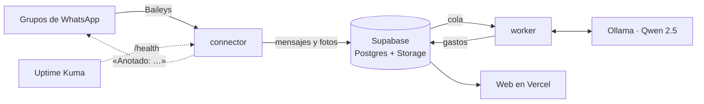

# Desplegar Luks en Oracle Cloud Always Free

Todo lo que no es la web corre en una sola máquina gratuita de Oracle Cloud:



| Servicio | Qué hace | Memoria |
|---|---|---|
| `connector` | Sesiones de WhatsApp, enlace de grupos, ingesta y confirmaciones ([services/connector](../services/connector/README.md)) | ~300 MB |
| `worker` | OCR, QR DIAN, Qwen y Laya: vuelve gasto cada mensaje ([services/worker](../services/worker/README.md)) | ~3 GB |
| `ollama` | El LLM local (`qwen2.5:7b`) | ~5 GB |
| `uptime-kuma` | Avisa si algo se cae | ~150 MB |

La web sigue en Vercel y la base en Supabase: aquí no se abre ningún puerto a internet.

---

## 1. La máquina (una sola vez)

1. Crea una cuenta en [oracle.com/cloud/free](https://www.oracle.com/cloud/free/). La **región principal no se cambia después**: elige la más cercana (Bogotá, Querétaro, São Paulo…).
2. **☰ → Compute → Instances → Create instance:**
   - **Image:** Oracle Linux 9 o Ubuntu 24.04 (los dos sirven; abajo están los comandos de cada uno).
   - **Shape:** Ampere → `VM.Standard.A1.Flex` con **4 OCPU y 24 GB**. Es lo máximo gratis. Con menos, pon `OLLAMA_MODEL=qwen2.5:3b`.
   - **Networking:** marca **Automatically assign public IPv4 address**.
   - **SSH keys:** *Generate a key pair for me* y **descarga la llave privada** (sin ella no entras).
   - **Boot volume:** *Specify a custom size* → **100 GB**.
   - Si sale *Out of capacity*, prueba otro *Availability domain* o más tarde. Pasar la cuenta a *Pay As You Go* ayuda y sigue costando $0 dentro de lo gratuito.
3. **¿Quedó sin IP pública?** Instancia → **Networking** → la VNIC → **IP administration** → ⋯ junto a la IP privada → **Edit** → *Ephemeral public IP*.
4. **¿La creaste más pequeña?** Instancia → **Edit** → **Edit shape** → despliega la fila de `VM.Standard.A1.Flex` con la flechita ▸ → 4 OCPU y 24 GB → *Save changes*. Se reinicia sola.

## 2. Entrar por SSH

En Windows (PowerShell), la primera vez protege la llave:

```powershell
icacls "$HOME\Downloads\ssh-key-XXXX.key" /inheritance:r /grant:r "$($env:USERNAME):(R)"
ssh -i $HOME\Downloads\ssh-key-XXXX.key opc@TU_IP        # Oracle Linux (en Ubuntu el usuario es ubuntu)
```

## 3. Disco y Docker

Oracle Linux 9:

```bash
sudo /usr/libexec/oci-growfs -y          # usa los 100 GB completos (por defecto ve ~30)
sudo dnf -y install dnf-plugins-core git
sudo dnf config-manager --add-repo https://download.docker.com/linux/rhel/docker-ce.repo
sudo dnf -y install --allowerasing docker-ce docker-ce-cli containerd.io docker-buildx-plugin docker-compose-plugin
sudo systemctl enable --now docker
sudo usermod -aG docker opc
exit                                     # vuelve a entrar para que tome el permiso
```

Ubuntu 24.04:

```bash
curl -fsSL https://get.docker.com | sudo sh
sudo usermod -aG docker ubuntu
exit
```

## 4. Luks

```bash
git clone https://github.com/ChristianMoraLopez/Lucas.git
cd Lucas/deploy
./configurar.sh
```

`configurar.sh` pide lo secreto sin mostrarlo en pantalla y escribe los dos `.env`:

| Pregunta | De dónde sale |
|---|---|
| URL de Supabase | Supabase → Project Settings → Data API → Project URL |
| Secret key de Supabase | Supabase → Project Settings → API Keys → **Secret keys**. Es la llave más delicada: solo vive en este servidor |
| Usuario y token de Hugging Face | Opcional, para Laya: tu usuario y un token **Read** de [huggingface.co/settings/tokens](https://huggingface.co/settings/tokens) |
| DSN de Sentry | Opcional: Sentry → Project → Client Keys |

La llave que cifra las sesiones de WhatsApp (`SESSION_ENCRYPTION_KEY`) la genera el script. **Guárdala aparte**: si se pierde, hay que volver a vincular los números.

Antes de arrancar, la base tiene que estar al día con las migraciones (`supabase db push`, o el SQL de `supabase/migrations/` en orden desde el SQL Editor).

```bash
docker compose up -d --build             # la primera vez 15–30 min: imágenes y el modelo (~5 GB)
docker compose ps                        # todo «running» / «healthy»
docker compose exec worker python -m lucas_worker check
```

`check` debe salir con ✓ en Supabase, OCR, Ollama y (si lo configuraste) Laya.

## 5. El número contador de WhatsApp

Es el número que la gente agrega a sus grupos. Usa una **SIM aparte** (prepago sirve), no tu número personal: Baileys se conecta como un «dispositivo vinculado» y WhatsApp no lo aprueba oficialmente.

```bash
docker compose exec connector node dist/cli.js vincular-contador              # muestra un QR
docker compose exec connector node dist/cli.js vincular-contador 573001234567 # o un código de 8 letras
```

En el celular del contador: **WhatsApp → Dispositivos vinculados → Vincular un dispositivo**. Escanea el QR o toca *Vincular con el número de teléfono* y escribe el código. Al quedar listo, el comando lo dice. El código cambia cada 2 o 3 minutos: si WhatsApp dice que no sirve, usa el que muestre el comando en ese momento.

```bash
docker compose exec connector node dist/cli.js estado
```

El celular del contador puede quedarse guardado: el dispositivo vinculado sigue funcionando aunque el teléfono esté apagado (WhatsApp pide abrirlo al menos cada 14 días).

## 6. Conectar un grupo

En la web, cada cuenta tiene **Personas → Conectar WhatsApp**. Ahí está el número contador y el mensaje para el grupo:

1. Agreguen el número contador al grupo (Luks saluda y explica).
2. Alguien escribe en el grupo **`luks PASEO-7K2Q`**: el código de invitación de la cuenta.
3. Luks responde «Listo: este grupo quedó conectado a «Paseo»» y la pantalla se actualiza sola.

Desde ahí, las fotos de recibos, los PDFs y los mensajes con montos («almuerzo 45 lucas, la pagó Mafe») llegan a la cuenta. La charla del grupo no sale de WhatsApp.

## 7. Uptime Kuma (avisos)

Kuma escucha solo en `127.0.0.1`. Para entrar, abre un túnel desde tu computador y deja esa ventana abierta:

```powershell
ssh -i $HOME\Downloads\ssh-key-XXXX.key -L 3001:localhost:3001 opc@TU_IP
```

Abre <http://localhost:3001>, crea tu usuario y agrega estos monitores:

| Monitor | Tipo | URL | Avisa si… |
|---|---|---|---|
| WhatsApp contador | HTTP(s) | `http://connector:8080/health` | se cerró la sesión del número contador |
| Cola del worker | HTTP(s) | `http://connector:8080/health/cola` | un trabajo lleva más de 15 min esperando (worker caído u Ollama colgado) |
| Web | HTTP(s) | `https://mrluks.com/login` | la web no responde |
| Supabase | HTTP(s) | `https://xxxx.supabase.co/auth/v1/health` (código esperado 401) | Supabase no responde |

En **Settings → Notifications** configura cómo te avisa (Telegram, correo, Discord…). Si la sesión del contador se cierra desde el teléfono, además queda un aviso en Sentry y en la pantalla de Conectar WhatsApp.

## 8. Actualizar

```bash
cd ~/Lucas && git pull && cd deploy && docker compose up -d --build
```

Los volúmenes (`luks-ollama`, `luks-models`, `luks-kuma`) sobreviven: no se vuelve a bajar el modelo.

## Notas

- **Oracle apaga las máquinas gratuitas** que pasan una semana casi sin uso. Si pasa, se vuelve a encender desde *Instances → Start*. Pasar la cuenta a *Pay As You Go* lo evita.
- **Para que WhatsApp no bloquee el número:** Luks escribe poco, con un mínimo de 20 s entre mensajes por grupo y topes por hora (`services/connector/.env`). Si no quieres confirmaciones, apágalas por grupo desde la web o con `GROUP_REPLIES=false`.
- **Si ya tenías el worker solo** (`services/worker/docker-compose.yml`): `docker compose -f ../services/worker/docker-compose.yml down` y, para no volver a bajar el modelo, copia sus volúmenes antes de arrancar:
  ```bash
  docker volume create luks-ollama && docker run --rm -v worker_ollama:/de -v luks-ollama:/a alpine cp -a /de/. /a/
  docker volume create luks-models && docker run --rm -v worker_models:/de -v luks-models:/a alpine cp -a /de/. /a/
  ```
