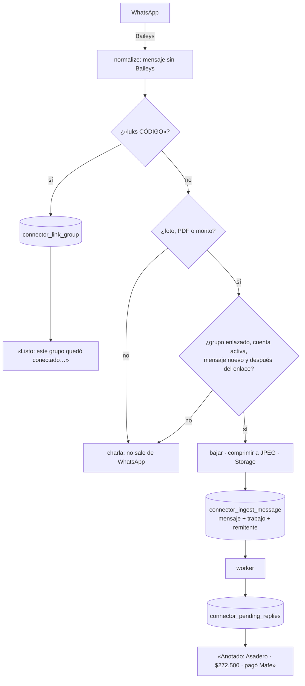

# Luks · connector de WhatsApp

Lee los grupos de WhatsApp enlazados a una cuenta de Luks y deja en la cola lo que parece un gasto: fotos de recibos, PDFs y mensajes con montos. El [worker](../worker/README.md) los vuelve gastos. Node 22, TypeScript y [Baileys](https://github.com/WhiskeySockets/Baileys) 7.



## Qué hace

| | | Dónde |
|---|---|---|
| Sesiones | El **número contador** (uno, el que la gente agrega a sus grupos) y **vinculaciones personales** opcionales (Luks lee los grupos desde el WhatsApp de alguien, sin agregar el contador). Se piden desde la web o la CLI y el connector las arranca solo | `manager.ts` |
| Reconexión | Si se cae, se reconecta con espera creciente (2 s … 1 min). Si la cierran desde el teléfono o no la vinculan a tiempo, borra las credenciales, la marca desconectada y **avisa** (Sentry, logs, `/health` y la pantalla de Conectar WhatsApp) | `whatsapp/baileys.ts` |
| Credenciales | Las de Baileys (creds y cada llave de Signal) se guardan **cifradas con AES-256-GCM** en Postgres (`whatsapp_connections`, `whatsapp_session_keys`). El contexto del cifrado ata cada valor a su sesión y su llave | `crypto.ts`, `whatsapp/auth-state.ts` |
| Grupos | Cuando agregan a Luks a un grupo, lo anota y saluda una vez. El grupo se enlaza a una cuenta cuando alguien escribe **`luks CÓDIGO`** con un código de invitación vigente (también sirve `lucas CÓDIGO`, el nombre de antes) | `ingest.ts` |
| Ingesta | Solo de grupos enlazados, solo lo escrito después del enlace, sin repetir (`unique (group_id, wa_message_id)`). Fotos a JPEG de 1600 px; PDFs tal cual (máximo 6 MB, el límite del bucket) | `ingest.ts`, `media.ts` |
| Remitentes | Cada número que escribe queda anotado por cuenta. Los que no son de nadie le aparecen a un admin en la web: «¿Quién es este número?». En grupos con LID (WhatsApp oculta el número) se intenta traducir a número; si no se puede, queda «lid:…» | `whatsapp/normalize.ts` |
| Confirmaciones | Opcionales por grupo. Lo que llegó seguido va en un solo mensaje; mínimo 20 s entre mensajes del mismo grupo, 20 por hora por grupo y 60 en total. Solo escribe el contador, nunca una sesión personal | `replies.ts` |
| Monitoreo | `/health` (contador conectado), `/health/cola` (la cola del worker avanza) y `/health/vivo`, para Uptime Kuma | `health.ts` |

### La interfaz `MessagingConnector`

Nada de la ingesta, el enlace ni las confirmaciones sabe que detrás está Baileys: todo depende de [`connector.ts`](src/connector.ts). Para pasar a la **API oficial (WhatsApp Cloud API)** basta otra implementación: recibe los mensajes por webhook y los entrega con `onMessage` como `IncomingMessage`, y `sendText` llama a su endpoint.

```ts
interface MessagingConnector {
  start(): Promise<void>;          // conecta y se reconecta solo
  stop(): Promise<void>;           // deja de escuchar sin desvincular
  logout(): Promise<void>;         // desvincula
  isConnected(): boolean;
  groups(): ReadonlySet<string>;   // grupos donde está
  sendText(chatId: string, text: string): Promise<void>;
}
```

## Correr

En el servidor va con todo lo demás: ver [deploy/README.md](../../deploy/README.md).

```bash
docker compose exec connector node dist/cli.js vincular-contador [573001234567]
docker compose exec connector node dist/cli.js estado
docker compose exec connector node dist/cli.js desvincular-contador
```

Las variables están explicadas en [.env.example](.env.example). Las obligatorias son `SUPABASE_URL`, `SUPABASE_SERVICE_ROLE_KEY` y `SESSION_ENCRYPTION_KEY` (`openssl rand -base64 32`).

## Desarrollo

```bash
pnpm --filter @lucas/connector test        # 59 pruebas: cifrado, textos, normalización, ingesta, límites y sesiones
pnpm --filter @lucas/connector typecheck
pnpm --filter @lucas/connector dev         # con un .env propio (no uses el número contador de producción)
```

Las funciones de la base que usa están en `supabase/migrations/00000000000080_whatsapp_connector.sql`, con sus pruebas en `supabase/tests/whatsapp.test.ts`.

## Privacidad

- Solo se guarda lo que parece un gasto; la conversación del grupo no sale de WhatsApp.
- Los logs y Sentry llevan ids, estados y tiempos, nunca el texto de los mensajes ni números completos (`57•••4567`).
- Las credenciales de WhatsApp nunca quedan en claro fuera de la memoria del proceso.
