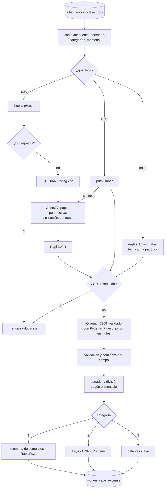

# Lucas worker

Convierte lo que llega a una cuenta (foto de un recibo, PDF o mensaje como «taxis al aeropuerto 100 lucas, la pagó Santi») en un gasto con comercio, fecha, total, ítems, categoría, quién pagó y la confianza de cada campo. Reemplaza al procesador simulado de la base: toma los trabajos de la misma cola (`public.jobs`).

Corre en CPU, sin APIs pagas: OCR y Laya sobre ONNX Runtime, Qwen 2.5 en Ollama. Pensado para la VM gratuita de **Oracle Cloud (Ampere A1, arm64)**.



## Qué hace cada paso

| Paso | Cómo | Dónde |
|---|---|---|
| Cola | `worker_claim_jobs` con `FOR UPDATE SKIP LOCKED`; rescata trabajos abandonados. Si algo falla, `worker_fail_job` lo registra en `job_errors` y lo reintenta a los 30 s, 1, 2, 4… min (máx. 1 h) hasta `max_attempts` (5). Los errores definitivos (PDF con clave, archivo que no existe) no se reintentan. | `queue.py`, migración 70 |
| Texto | Montos colombianos («100 lucas», «1,2 palos», «$84.300»), fechas («26/09», «ayer», «el sábado»), comercio del mensaje. | `extract/rules.py`, `extract/numbers.py` |
| PDF | `pdfplumber` si es digital (exacto, confianza 1). Si no tiene texto, cada página va a imagen y a OCR. El CUFE sale del texto o del QR. | `extract/pdf.py` |
| QR DIAN | `zxing-cpp` sobre varias versiones de la foto. Del QR salen CUFE, total, fecha y NIT, casi seguros. | `extract/qr_dian.py` |
| Fotos | OpenCV encuentra el papel y corrige perspectiva e inclinación, CLAHE para el contraste; RapidOCR (modelos incluidos en el paquete, sin descargas) lee y se arman renglones. Si la versión mejorada lee peor, se usa la original. | `extract/image.py`, `extract/ocr.py` |
| LLM | Ollama con `format` = esquema JSON de `ReceiptExtraction`: el modelo solo puede responder ese JSON. Se valida con Pydantic; si falla, se le devuelve el error una vez. Incluye `description_en`, la descripción normalizada en inglés. | `llm/` |
| Validación | Cruza QR, reglas y LLM: si coinciden, sube la confianza; si el LLM dice un total que no aparece en el recibo, baja. Revisa sumas (subtotal + IVA, ítems), fechas futuras o fuera del evento. | `validate.py` |
| Pagador | «la pagó Santi», «Vale pagó», «pagado por Laura», «invitó Juanca» → esa persona (prefijo o RapidFuzz); si no, quien lo mandó. «entre Vale y Santi» divide solo entre ellos. | `payer.py` |
| Categoría | Memoria de comercios de la cuenta (exacta o con RapidFuzz, aguanta errores de OCR) → Laya → palabras clave → «Otros». | `classify/` |
| Duplicados | Huella perceptual de 256 bits (misma foto recomprimida ≈ 4 bits de diferencia; recibos distintos > 90) y CUFE. Se revisan antes del OCR y otra vez al guardar, con un candado por cuenta. Mismo comercio, día y valor: no se descarta, pero va a revisión marcado. | `worker_save_expense` |
| Decisión | Se confirma solo si la categoría salió de la memoria, hay pagador, total y todos los campos tienen ≥ 0,9. Lo demás va a **Revisar**. | `pipeline.py` |

Nada del contenido de los recibos va a los logs ni a Sentry (sin variables locales, sin cuerpos): solo ids, etapas, tiempos y errores.

## Laya, en dos variantes

Laya ([convaiinnovations/laya](https://huggingface.co/convaiinnovations/laya)) es un modelo de decisiones tipadas: recibe un *state* y una pregunta con opciones, y devuelve probabilidades calibradas en una sola pasada. El worker lo corre con ONNX Runtime, sin PyTorch: `classify/laya_format.py` es el formato de entrada copiado de `laya` 0.3.22 (Apache 2.0), y `tests/test_laya.py` comprueba que produce exactamente la misma secuencia que el paquete oficial.

Todo pasa por la interfaz `CategoryModel`. Se elige la variante con `LAYA_VARIANT`:

| Variante | Base | Lee |
|---|---|---|
| `multilingual` (por defecto) | `laya-multilingual` (mmBERT-base, 322M) | comercio, mensaje, ítems y texto del recibo, en español |
| `english` | `laya` (ModernBERT-large, 421M) | comercio y `description_en` del LLM |

### Ajustarlo con las correcciones de la gente

1. Cada vez que alguien cambia la categoría en **Revisar**, queda un ejemplo en `training_examples`.
2. Exporta (en el servidor o en tu PC, con las mismas variables de Supabase):

   ```bash
   uv run python scripts/export_training.py --variante ambas --incluir-confirmados --marcar
   ```

   Sale `laya-data/` y `laya-data.zip` con `train.jsonl`, `test.jsonl`, `lucas_question.json` y `stats.json` por variante, en el formato *typed decisions* de Laya (`state`, `questions`, `gold`). Antes de salir se quitan los nombres de quién pagó y los números largos (teléfonos, cédulas, NIT).
3. Abre [`notebooks/laya_lucas_finetune.ipynb`](notebooks/laya_lucas_finetune.ipynb) en Colab o Kaggle (GPU T4 gratis), sube el zip y corre todo. El notebook ajusta con la receta del notebook oficial de Laya, calibra la temperatura, compara contra el modelo sin ajustar, exporta a ONNX INT8, verifica que el ONNX responda igual que PyTorch y sube `<variante>/` a tu repo privado de Hugging Face (`HF_REPO`).
4. En el servidor: `docker compose restart worker`.

Sin correcciones todavía, corre el notebook con `SOLO_EXPORTAR = True`: sube el modelo base (zero-shot) y el worker le pone techo a su confianza (`LAYA_ZERO_SHOT_MAX_CONFIDENCE`) para que todo lo que clasifique pase por revisión. Sin ningún modelo, el worker usa memoria y palabras clave.

## Desplegar en Oracle Cloud (Always Free, ARM)

1. **La VM.** *Compute → Instances → Create*: imagen **Ubuntu 24.04**, forma **VM.Standard.A1.Flex** con 4 OCPU y 24 GB. No hace falta abrir puertos: el worker solo sale a internet (Supabase, Hugging Face, Sentry).
2. **Docker:**

   ```bash
   sudo apt-get update && sudo apt-get install -y docker.io docker-compose-v2 git
   sudo usermod -aG docker $USER && newgrp docker
   ```

3. **El código y la configuración:**

   ```bash
   git clone https://github.com/ChristianMoraLopez/Lucas.git && cd Lucas/services/worker
   cp .env.example .env && nano .env      # Supabase, HF_REPO/HF_TOKEN, SENTRY_DSN
   ```

4. **La base.** Desde tu PC, en la raíz del repo: `npx supabase db push`. La migración `00000000000070_worker.sql` crea las funciones del worker y **apaga el procesador simulado**; desde ahí, lo que se suba espera en la cola hasta que el worker arranque.
5. **Arrancar:**

   ```bash
   docker compose up -d --build           # construye en arm64 nativo; baja qwen2.5 la primera vez (~5 GB)
   docker compose exec worker python -m lucas_worker check
   docker compose logs -f worker
   ```

   `check` revisa Supabase, OCR, Ollama con su modelo, Laya y Sentry, y dice qué falta.
6. **Actualizar:** `git pull && docker compose up -d --build`.

Tiempos de referencia **estimados, todavía sin medir en la VM**: OCR de una foto 2–4 s, Laya menos de 1 s y Qwen 2.5 7B entre 40 s y 2 min por recibo en 4 OCPU (con `qwen2.5:3b`, más o menos la mitad). En un PC x86 el OCR de los recibos de ejemplo toma 0,5–0,8 s. Los tiempos reales de cada etapa quedan en los logs (`elapsed_ms`) y en Sentry si activas trazas.

Para construir la imagen arm64 desde un PC x86: `docker buildx build --platform linux/arm64 -t lucas-worker .`

## Comandos

```bash
python -m lucas_worker            # procesa la cola para siempre (lo que corre Docker)
python -m lucas_worker once       # procesa lo que haya y sale
python -m lucas_worker check      # revisa conexiones y modelos
python -m lucas_worker warmup     # carga OCR y baja Laya
python -m lucas_worker health     # latido reciente (HEALTHCHECK de Docker)
```

Para ver qué pasó con un mensaje (en el SQL Editor de Supabase):

```sql
select j.status, j.attempts, j.last_error, e.error, e.created_at
from jobs j left join job_errors e on e.job_id = j.id
where j.payload ->> 'message_id' = '<id del mensaje>'
order by e.created_at;
```

## Desarrollo

Necesitas [uv](https://docs.astral.sh/uv/) y Python 3.12.

```bash
uv sync                      # entorno con dependencias de desarrollo
uv run pytest                # 118 pruebas: reglas, QR, OCR y PDF con los recibos de ejemplo, LLM, Laya, cola…
uv run ruff check . && uv run ruff format --check .
uv run python scripts/make_fixtures.py   # regenera tests/fixtures/
uv run python scripts/build_notebook.py notebooks/laya_lucas_finetune.ipynb
```

Las pruebas usan los recibos de `tests/fixtures/` (una panadería con QR DIAN, la misma «fotografiada» con perspectiva, sombra y ruido, la misma recomprimida, una tienda sin QR, una factura PDF digital y una escaneada) con OCR, QR y PDF de verdad, y dobles de Supabase y de Ollama. Las funciones SQL del worker tienen sus propias pruebas sobre Postgres real en `supabase/tests/worker.test.ts`.

Para probar contra Supabase local sin Ollama: `LLM_ENABLED=false uv run python -m lucas_worker once`.

## Estructura

```
lucas_worker/
├── __main__.py         CLI: run, once, check, warmup, health
├── config.py           variables de entorno (pydantic-settings)
├── queue.py            ciclo de la cola, reintentos, señales, latido
├── pipeline.py         un mensaje de principio a fin
├── extract/            reglas, números, QR DIAN, OpenCV, RapidOCR, pdfplumber y la cascada
├── llm/                esquema Pydantic, prompt y cliente de Ollama
├── validate.py         confianza por campo
├── payer.py            quién pagó y entre quiénes
├── classify/           categorías, memoria (RapidFuzz), Laya ONNX y la cascada
├── supabase.py         RPC y Storage con httpx
└── observability.py    logs JSON y Sentry
scripts/                export_training.py, make_fixtures.py, build_notebook.py
notebooks/              ajuste de Laya en Colab o Kaggle
tests/                  pytest + recibos de ejemplo
```
